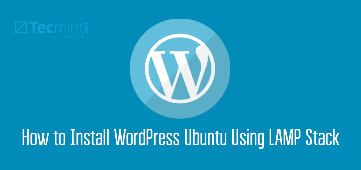

### Apache Virtual Hosts

### How To Set Up Apache Virtual Hosts


- Make Server and Link it with Domain

- Create Separate Web Root Directories for Websites (ex: in /var/www/mysite)

- Create Config File for Each Site in sites-available
   - Ceate File
   ```console
   nano sites-available/my-site.conf
   ```
   - Here is File Content
   ```console
   <VirtualHost *:80>
     ServerName blog.mickybro.cf
     ServerAlias www.blog.mickybro.cf
     DocumentRoot /var/www/blog
     ServerAdmin contact.mickybro.cf
     ErrorLog ${APACHE_LOG_DIR}/error.log
     CustomLog ${APACHE_LOG_DIR}/access.log combined
   </VirtualHost>
   ``` 

- Enable Virtual Hosts
  - Link sites-available config to sites-enable
   ```console
   a2ensite blog.conf
   ```
   - Test Apache Configuration
	```console
	sudo apache2ctl configtest
	```
   - Restart Apache
   ```console
   systemctl reload apache2
   ```

### How to Configure SSL Certificate in Apache Web Server


### Add SSL Certificate to Ubuntu Server
- Make Directory for Certificates:
	```console
	mkdir /etc/encryption
	``` 
- Generate CSR & Private Key:
	```console
	openssl req -new -newkey rsa:2048 -nodes -keyout /etc/encryption/server.key -out /etc/encryption/server.csr
	```
- Create SSL Certificate
	- Use Any SSL Certificate Provider (ex: zerossl.com)
	- Get Server CSR 
	```console
	cat /etc/encryption/server.csr
	```
	- Download & Place Certificate in above Directory

- Configure the Apache SSL Parameters
	- Create Params.conf file
	```console
	sudo nano /etc/apache2/conf-available/ssl-params.conf
	```
	- Here is file Contents
	```console
	SSLCipherSuite EECDH+AESGCM:EDH+AESGCM:AES256+EECDH:AES256+EDH
	SSLProtocol All -SSLv2 -SSLv3 -TLSv1 -TLSv1.1
	SSLHonorCipherOrder On
	# Disable preloading HSTS for now.  You can use the commented out header line that includes
	# the "preload" directive if you understand the implications.
	# Header always set Strict-Transport-Security "max-age=63072000; includeSubDomains; preload"
	Header always set X-Frame-Options DENY
	Header always set X-Content-Type-Options nosniff
	# Requires Apache >= 2.4
	SSLCompression off
	SSLUseStapling on
	SSLStaplingCache "shmcb:logs/stapling-cache(150000)"
	# Requires Apache >= 2.4.11
	SSLSessionTickets Off
	```

- Configure the Apache Virtual Host
	- Backp Current Config
	```console
	sudo cp /etc/apache2/sites-available/default-ssl.conf /etc/apache2/sites-available/default-ssl.conf.bak
	```
	- Create default-ssl.conf file
	```console
	sudo nano /etc/apache2/sites-available/default-ssl.conf
	```
	- Here is File Content
	```console
	ServerName yourdomain.com
    ServerAlias www.yourdomain.com

    SSLEngine on

    SSLCertificateFile path-to-certificate.crt
    SSLCertificateKeyFile path-to-private-key.key 
	```
- Redirect HTTP to HTTPS
	- Edit Apache Site Config File
	```console
	sudo nano /etc/apache2/sites-available/000-default.conf 
	```
	- Here is File Content
	```console
	ServerAdmin youremail.com
	ServerName yourdomain.com
  	ServerAlias www.yourdomain.com
  	Redirect permanent / https://example.com/ 
	```
- Update the Firewall Settings
	```console
	sudo ufw app list
	sudo ufw allow in "Apache Full"
	```
- Enable the mod_ssl module and other configurations
	```console
	sudo a2 enmod ssl
	sudo a2 enmod headers
	sudo a2ensite default-ssl
	sudo a2enconf ssl-params
	```
- Test Apache Configuration
	```console
	sudo apache2ctl configtest
	```
- Restart Apache Server
	```console
	sudo systemctl restart apache2
	```
 ### Add SSL Certificate Using Certbot
- Install Certbot
    ```console
  sudo apt install certbot python3-certbot-apache
  sudo certbot --apache
  sudo certbot renew --dry-run (only for renew)
  ```

### Hardening Linux Apache Web Server


- Keep Up to Date Server Package

- Auto Update Enable
  - Install Unattended-upgrades
   ```console
    sudo apt install unattended-upgrades
   ```
   - Enable Unattended-upgrades
   ```console
    sudo dpkg-reconfigure --priority=low unattended-upgrades
   ```

- Securing User Login
  - Create Least Privladge User
   ```console
    useradd -m -s /bin/bash {username} && passwd {username}
    usermod -aG sudo {username}
   ```
   - Enable Key Authentication
   - Disable Root Login
   ```console
    sudo nano /etc/ssh/ssh_config
    PermitRootLogin no
    AllowUsers {username}
    Port {random port}
    PasswordAuthentication no
   ```
   
- Configure Firewall
  - Install UFW
   ```console
    sudo apt install ufw
    sudo ufw allow {ssh-port}
    sudo ufw enable
    sudo ufw status
    sudo ufw allow "Apache Full"
   ```
   - Enable Key Authentication
   - Disable Root Login
   ```console
    sudo nano /etc/ssh/ssh_config
    PermitRootLogin no
    AllowUsers {username}
    Port {random port}
    PasswordAuthentication no
   ```

- Disable Directory Listing & Server Signature
   - Add These Lines to apache2.conf > web directory
   ```console
    Options -Indexes
   ```

- Disable Access for .ht Files
   - Change These Lines
   ```console
   <FilesMatch "^\.ht">
    Require all denied
   </FilesMatch>
   ```

- Change File Permisions
   - Set File Ownerships to www-data
   ```console
   chown www-data:www-data {file-name}
   ```

- Set Password
   - Create .htaccess file
   - Add These Lines
   ```console
   AuthType Basic
   AuthName "Testing in Progress"
   AuthUserFile /etc/apache2/.htpasswd
   Require valid-user
   ```
   - Makesure Directory Override Set to All 
   - Restart Apache Server

#### Install Wordpress on Ubuntu



- Setup Server Basics
  - Creating a New User
  - Granting Administrative Privileges
  - Setting Up a Basic Firewall
  - Disable Root Login
  - Disable Password Auth & Enable Key Auth
  - Change SSH Port

- Installing Apache
   ```console
    sudo apt install apache2
   ```

- Installing MySQL
   ```console
    sudo apt install mysql-server
    sudo mysql_secure_installation
    sudo mysql
    CREATE DATABASE wordpress DEFAULT CHARACTER SET utf8 COLLATE utf8_unicode_ci;
    CREATE USER 'wordpressuser'@'%' IDENTIFIED WITH mysql_native_password BY 'password';
    GRANT ALL ON wordpress.* TO 'wordpressuser'@'%';
    FLUSH PRIVILEGES;
   ```

- Installing PHP
   ```console
    sudo apt install php libapache2-mod-php php-mysql
    sudo apt install php-curl php-gd php-mbstring php-xml php-xmlrpc php-soap php-intl php-zip
    sudo systemctl restart apache2
   ```

- Download Wordpress
   ```console
    curl -O https://wordpress.org/latest.tar.gz
    tar xzvf latest.tar.gz
    cp /tmp/wordpress/wp-config-sample.php /tmp/wordpress/wp-config.php
    Change database name, user, password, salt in config file
    sudo chown -R www-data:www-data /var/www/wordpress
   ```

- Craete Wordpress V_Host
   ```console
    sudo nano /etc/apache2/sites-available/wordpress.conf
    Change ServerName, ServerAlias, ServerAdmin etc..
    sudo a2ensite wordpress.conf
   ```

- Adjusting Apache’s Configuration Overwrite
   ```console
    sudo nano /etc/apache2/sites-available/wordpress.conf
    <Directory /var/www/wordpress/>
      AllowOverride All
    </Directory>
    sudo a2enmod rewrite
   ```
 
 #### Tested on Ubuntu 20.04
