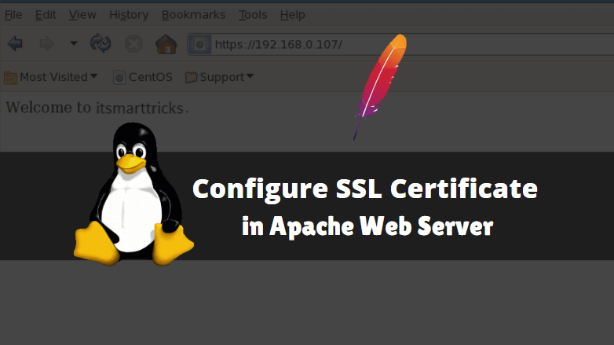

### Apache Virtual Hosts

#### How To Set Up Apache Virtual Hosts


- Make Server and Link it with Domain

- Create Separate Web Root Directories for Websites (ex: in /var/www/mysite)

- Create Config File for Each Site in sites-available
   - Ceate File
   ```console
   nano sites-available/my-site.conf
   ```
   - Here is File Content
   ```console
   <VirtualHost *:80>
     ServerName blog.mickybro.cf
     ServerAlias www.blog.mickybro.cf
     DocumentRoot /var/www/blog
     ServerAdmin contact.mickybro.cf
     ErrorLog ${APACHE_LOG_DIR}/error.log
     CustomLog ${APACHE_LOG_DIR}/access.log combined
   </VirtualHost>
   ``` 

- Enable Virtual Hosts
  - Link sites-available config to sites-enable
   ```console
   a2ensite blog.conf
   ```
   - Test Apache Configuration
	```console
	sudo apache2ctl configtest
	```
   - Restart Apache
   ```console
   systemctl reload apache2
   ```


# SSL Certificate in Apache Web Server

##### How to Configure SSL Certificate in Apache Web Server



### Add SSL Certificate to Ubuntu Server
- Make Directory for Certificates:
	```console
	mkdir /etc/encryption
	``` 
- Generate CSR & Private Key:
	```console
	openssl req -new -newkey rsa:2048 -nodes -keyout /etc/encryption/server.key -out /etc/encryption/server.csr
	```
- Create SSL Certificate
	- Use Any SSL Certificate Provider (ex: zerossl.com)
	- Get Server CSR 
	```console
	cat /etc/encryption/server.csr
	```
	- Download & Place Certificate in above Directory

- Configure the Apache SSL Parameters
	- Create Params.conf file
	```console
	sudo nano /etc/apache2/conf-available/ssl-params.conf
	```
	- Here is file Contents
	```console
	SSLCipherSuite EECDH+AESGCM:EDH+AESGCM:AES256+EECDH:AES256+EDH
	SSLProtocol All -SSLv2 -SSLv3 -TLSv1 -TLSv1.1
	SSLHonorCipherOrder On
	# Disable preloading HSTS for now.  You can use the commented out header line that includes
	# the "preload" directive if you understand the implications.
	# Header always set Strict-Transport-Security "max-age=63072000; includeSubDomains; preload"
	Header always set X-Frame-Options DENY
	Header always set X-Content-Type-Options nosniff
	# Requires Apache >= 2.4
	SSLCompression off
	SSLUseStapling on
	SSLStaplingCache "shmcb:logs/stapling-cache(150000)"
	# Requires Apache >= 2.4.11
	SSLSessionTickets Off
	```

- Configure the Apache Virtual Host
	- Backp Current Config
	```console
	sudo cp /etc/apache2/sites-available/default-ssl.conf /etc/apache2/sites-available/default-ssl.conf.bak
	```
	- Create default-ssl.conf file
	```console
	sudo nano /etc/apache2/sites-available/default-ssl.conf
	```
	- Here is File Content
	```console
	ServerName yourdomain.com
    ServerAlias www.yourdomain.com

    SSLEngine on

    SSLCertificateFile path-to-certificate.crt
    SSLCertificateKeyFile path-to-private-key.key 
	```
- Redirect HTTP to HTTPS
	- Edit Apache Site Config File
	```console
	sudo nano /etc/apache2/sites-available/000-default.conf 
	```
	- Here is File Content
	```console
	ServerAdmin youremail.com
	ServerName yourdomain.com
  	ServerAlias www.yourdomain.com
  	Redirect "/" "https://your_domain_or_IP/" 
	```
- Update the Firewall Settings
	```console
	sudo ufw app list
	sudo ufw allow in "Apache Full"
	```
- Enable the mod_ssl module and other configurations
	```console
	sudo a2 enmod ssl
	sudo a2 enmod headers
	sudo a2ensite default-ssl
	sudo a2enconf ssl-params
	```
- Test Apache Configuration
	```console
	sudo apache2ctl configtest
	```
- Restart Apache Server
	```console
	sudo systemctl restart apache2
	```
  
 #### Tested on Ubuntu 20.04
